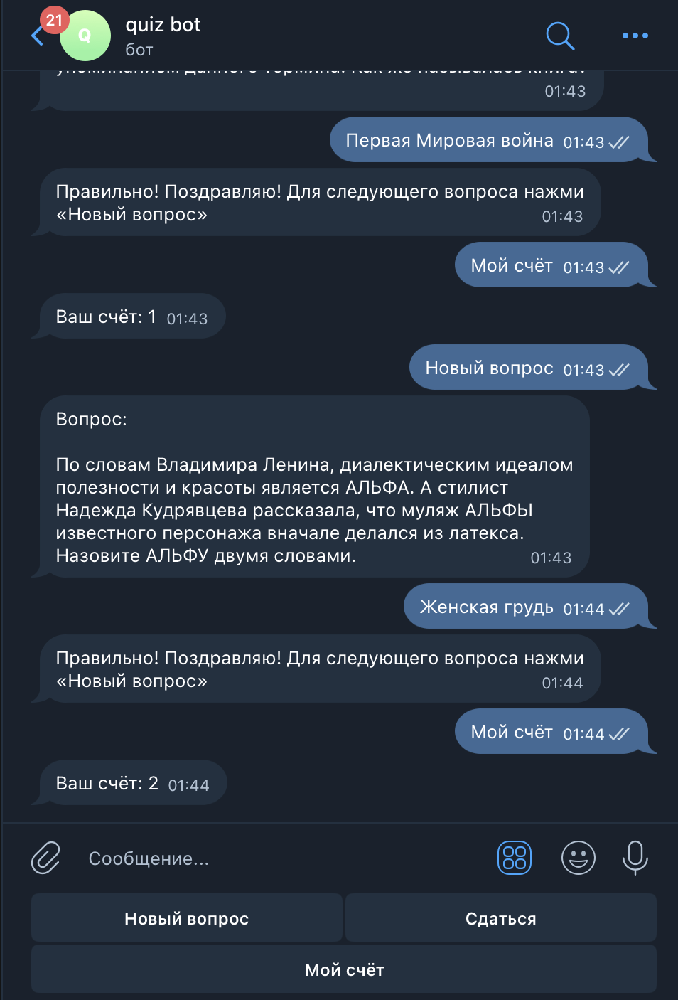

# Quiz Bot (Telegram & VK)

Бот для викторин, работает как в **Telegram**, так и во **ВКонтакте**.  
Пользователь может получать вопросы, проверять ответы, сдаваться и накапливать очки.

## Возможности
- Команды:
  - **Новый вопрос** — выдать случайный вопрос
  - **Сдаться** — показать правильный ответ и выдать следующий вопрос
  - **Мой счёт** — показать количество правильных ответов
  - **/start** — запуск
  - **/help** — помощь
  - **/cancel** — скрыть клавиатуру (только Telegram)

- Использует **Redis** для хранения вопросов, ответов и счёта.

## Требования
- Python 3.8-3.10
- Redis (локально или через облако)

## Запуск
### 1. Клонируйте репозиторий
```bash
git clone https://github.com/1ns0mn1a7/Victory-Telegram-Bot.git
cd Victory-Telegram-Bot
```

### 2. Установите зависимости
Создайте виртуальное окружение и установите зависимости:
```bash
python3.10 -m venv venv
source venv/bin/activate
pip install -r requirements.txt
```

### 3. Настройте виртуальное окружение
Создайте файл `.env` в корне проекта и добавьте туда переменные:

```env
# Telegram
TELEGRAM_BOT_TOKEN=ваш_токен_телеграм

# VK
VK_GROUP_TOKEN=ваш_токен_группы_вк

# Redis
REDIS_HOST=localhost или из облака
REDIS_PORT=17794
REDIS_PASSWORD=пароль
```

### 4. Запуск

**Telegram-бот**
```bash
python telegram_bot.py
```

**VK-бот**
```bash
python vk_bot.py
```

## Примеры
### VK
<p align="left">
  
</p>

[Открыть во ВКонтакте](https://vk.com/club231945578)

### Telegram
<p align="left">
  
</p>

[Открыть в Телеграмм](https://t.me/quizz_dev_bot)

## Цель проекта
Код написан в образовательных целях на онлайн-курсе для веб-разработчиков [dvmn.org](dvmn.org)
